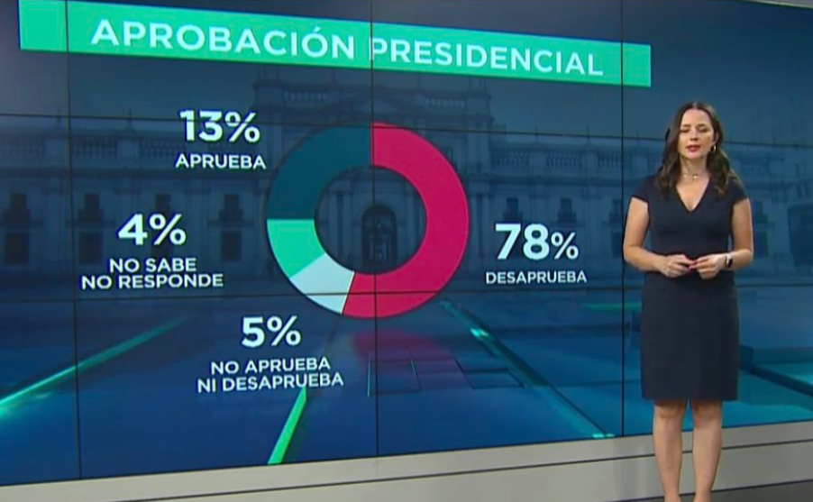

class: center, middle

.linea-superior[]
.linea-inferior[]


## Capacitación en R

## Visualización con ggplot2

### Diciembre 2020

```{r setup, include=FALSE}
options(htmltools.dir.version = FALSE)
knitr::opts_chunk$set(message = FALSE) 
```

```{r xaringan-themer, include=FALSE, warning=FALSE}
library(xaringanthemer)
#style_duo_accent(
 # primary_color = "#1381B0",
  #secondary_color = "#FF961C",
  #inverse_header_color = "#FFFFFF"
#)
```


---

background-image: url("imagenes/fondo2.PNG")
background-size: contain;
background-position: 100% 0%

# Contenidos de hoy

- Conceptos básicos de visualización

--

- Elementos básicos de ggplot  


---

background-image: url("imagenes/fondo2.PNG")
background-size: contain;
background-position: 100% 0%

# La importancia de la visualización

La visualización juega un rol importante en las etapas del análisis de datos:

- Exploración

- Modelamiento

- Comunicación

--

*"The simple graph has brought more information to the data analyst's mind than any other device."* - [John Tukey](https://es.wikipedia.org/wiki/John_W._Tukey)


--

**Los gráficos nos permiten comunicar y atraer la atención de una audiencia**: [The Joy of Stats](https://www.youtube.com/watch?v=V8lbiiTF2P0)


---

background-image: url("imagenes/fondo2.PNG")
background-size: contain;
background-position: 100% 0%

# La importancia de la visualización

## [Matejka & Fitzmaurice, 2017](https://www.autodeskresearch.com/publications/samestats) 

.center[

]


---

background-image: url("imagenes/fondo2.PNG")
background-size: contain;
background-position: 100% 0%

# Visualizaciones no efectivas


.center[

]


---

background-image: url("imagenes/fondo2.PNG")
background-size: contain;
background-position: 100% 0%

# Visualizaciones no efectivas

.center[

]


---

background-image: url("imagenes/fondo2.PNG")
background-size: contain;
background-position: 100% 0%

# Visualizaciones no efectivas



---

background-image: url("imagenes/fondo2.PNG")
background-size: contain;
background-position: 100% 0%

# Visualización efectiva

## Variables para mostrar atributos (Ward, Grinstein & Keim, 2015, Interactive Data Visualization)


- Posición
- Marca
- Tamaño
- Brillo
- Color
- Orientación
- Textura
- Movimiento
- Efecto de las variables visuales

--

## No es aconsejable incluir demasiados atributos en una misma visualización


---
background-image: url("imagenes/fondo2.PNG")
background-size: contain;
background-position: 100% 0%


# Visualización efectiva

Los gráficos requieren de nuestra capacidad visual para interpretar figuras geométricas.

--

[Cleveland & McGuill (1985)](http://webspace.ship.edu/pgmarr/Geo441/Readings/Cleveland%20and%20McGill%201985%20-%20Graphical%20Perception%20and%20Graphical%20Methods%20for%20Analyzing%20Scientific%20Data.pdf)

- Las mejores visualizaciones son aquellas que requieren el uso de la "visión instantánea".

- Y no requieren de un esfuerzo visual para ser comprendidas.

--

.center[La "visión instantánea" nos permite evaluar visualmente **patrones geométricos** y dimensionar **magnitudes**]

---

background-image: url("imagenes/fondo2.PNG")
background-size: contain;
background-position: 100% 0%

# Visualización efectiva

Cleveland ordena la dificultad de los elementos gráficos basado en la percepción para estimar variables cuantitativas.

--

De menor a mayor dificultad:

- **Posición** a lo largo de una escala común
- **Posición** en escalas no alineadas pero idénticas
- Longitud
- Ángulo o pendiente
- Área
- Saturación del color
- Tono del color


---


background-image: url("imagenes/fondo2.PNG")
background-size: contain;
background-position: 100% 0%


# Visualización efectiva

```{r, out.width = "700px", out.height="290px" , fig.align='center', echo=FALSE}
knitr::include_graphics("imagenes/clplot.png")
```

---

background-image: url("imagenes/fondo2.PNG")
background-size: contain;
background-position: 100% 0%

# Visualización efectiva

## Las tortas son para comer...

--

## [*Three reasons that pie charts suck*](https://www.richardhollins.com/blog/why-pie-charts-suck/)

.pull-left[

1. Son malos para comunicar lo básico, a menos que tengan etiquetas.

2. No son buenos para mostrar tendencias (aun cuando lo acompañen etiquetas).

3. No sirven para mostrar tendencias cuando se utilizan valores absolutos.
]

.pull-right[
]

---

background-image: url("imagenes/fondo2.PNG")
background-size: contain;
background-position: 100% 0%

# Receta para hacer ~~malos~~ gráficos

- Confunde a los demás respecto a lo que quieres mostrar (con etiquetas que no explican nada o características que no agregan información).

--

- Incluye muchos atributos (posición, color, tamaño, textura, forma)

--

- Usa un gráfico de torta (con efectos 3d).

--

- Incluye más de una escala en un mismo gráfico

--

- Si comparas más de un gráfico, ojalá utiliza distintas escalas.

--

.center[

]


---
.linea-superior[]
.linea-inferior[]


.center[
## Ahora que ya manejamos algunos conceptos, podemos pasar a `R`


]


---

background-image: url("imagenes/fondo2.PNG")
background-size: contain;
background-position: 100% 0%

# Gráficos en R 

R base ofrece herramientas de visualización

--


```{r pressure, fig.align='center', fig.height=3.7, fig.width=3.7, echo=TRUE}
plot(pressure)
```

--

Entonces, ¿por qué utilizar ggplot? 

---
background-image: url("imagenes/fondo2.PNG")
background-size: contain;
background-position: 100% 0%

# Gráficos en R 


`ggplot2` sigue una sintaxis coherente, lo que facilita su aprendizaje


```{r, fig.align='center', fig.height=3.7, fig.width=3.7, echo=TRUE}
library(ggplot2)
ggplot(data = pressure) + 
          geom_point(mapping = aes(x = temperature, y = pressure))
```

--

`ggplot2` se ha convertido en el estándar para la visualización en R

Estilo sobrio y elegante

Hay librerías en python que usan el diseño de ggplot 


---
background-image: url("imagenes/fondo2.PNG")
background-size: contain;
background-position: 100% 0%

# Descripción del dataset 

Trabajaremos con un dataset de nombres inscritos en el registro civil

--

Los datos se encuentran en el paquete guaguas de [Riva Quiroga](https://github.com/rivaquiroga/guaguas)

.center[

]

--


```{r, include=TRUE, eval=TRUE, warning=FALSE}
#install.packages("guaguas")
library(guaguas)
head(guaguas, 2)
```

--

### Generemos un gráfico de barras con la cantidad de mujeres y hombres

---
background-image: url("imagenes/fondo2.PNG")
background-size: contain;
background-position: 100% 0%

# Data set guaguas

Queremos un gráfico de barras que nos muestre cantidad de nombres por sexo

Echaremos mano a lo aprendido en sesiones anteriores

--

```{r, message=FALSE, warning=FALSE}
library(tidyverse)
tabla <- guaguas %>% 
  group_by(sexo) %>% 
  summarise(suma = sum(n))

tabla

```


---
background-image: url("imagenes/fondo2.PNG")
background-size: contain;
background-position: 100% 0%

# La sintaxis de ggplot

`ggplot` funciona con un sistema de capas

Siempre comenzaremos con la función ggplot

--

```{r, fig.align='center', fig.height=3, fig.width=4}
ggplot(data = tabla, aes(x = sexo, y = suma)) 
```
--

* `data`: tabla para la cual queremos generar el gráfico

* `aes`: viene de *aesthetics*. Contiene los elementos estéticos de nuestro gráfico

    + `x`: variable que será mapeada al eje x 
    + `y`: variable que será mapeada al eje y

---

background-image: url("imagenes/fondo2.PNG")
background-size: contain;
background-position: 100% 0%

# La sintaxis de ggplot


```{r, fig.align='center', fig.height=4, fig.width=5}
options(scipen = "999")
ggplot(data = tabla, aes(x = sexo, y = suma)) + 
  geom_bar(stat = "identity") #<< 
```

--

- `geom_bar`: capa de figura geométrica 

- *identity*: le dice a ggplot que no queremos hacer nada con los datos, es decir, graficar la tabla sin modificaciones 


---
background-image: url("imagenes/fondo2.PNG")
background-size: contain;
background-position: 100% 0%

# ¿Qué es exactamente identity?

.center[

]

--

`geom_bar` por defecto llama a la función `stat_count`

`stat_count` espera como input una sola variable 


```{r, error=T}
ggplot(data = tabla, aes(x = sexo, y = suma)) + 
  geom_bar()

```


---

background-image: url("imagenes/fondo2.PNG")
background-size: contain;
background-position: 100% 0%

# Un poco más sobre identity

Las 2 barras tienen la misma altura

¿Qué creen que está pasando acá?

```{r, fig.align='center', fig.height=2.4, fig.width=3.5}
ggplot(data = tabla, aes(x = sexo)) + 
  geom_bar()
```

--

La función por defecto `stat_count()` grafica la frecuencia de la variable `sexo` en la base de datos `tabla`. 

--

Cada sexo aparece una pura vez en la base de datos (el sexo ya está agrupado).


---

background-image: url("imagenes/fondo2.PNG")
background-size: contain;
background-position: 100% 0%

# La sintaxis de ggplot

Agreguemos una segunda capa

```{r, fig.align='center', fig.height=4, fig.width=5}
ggplot(data = tabla, aes(x = sexo, y = suma)) + 
  geom_bar(stat = "identity") + 
  geom_hline(aes(yintercept = mean(suma)) ) #<<
```

--

- `geom_hline`: línea horizontal 


---
background-image: url("imagenes/fondo2.PNG")
background-size: contain;
background-position: 100% 0%

# Ejercicio rápido

Creemos un gráfico de líneas que contenga la suma de guaguas inscritas para cada año

*Pista*: la capa para crear un gráfico de líneas es `geom_line` 

--

```{r, fig.align='center', fig.height=4, fig.width=5}
guaguas %>% 
  group_by(anio) %>% 
  summarise(suma = sum(n)) %>% 
  ggplot(aes(x = anio, y = suma)) +
  geom_line() #<<

```

---
background-image: url("imagenes/fondo2.PNG")
background-size: contain;
background-position: 100% 0%

# Agregando más atributos

Nombres de mujer más populares de 2019

```{r, fig.align='center', fig.height=4.5, fig.width=7}

top10 <- guaguas %>% 
  filter(anio == 2019 & sexo == "F") %>% 
  arrange(desc(n)) %>% 
  slice(1:10)

ggplot(top10, aes(x = nombre, y = n, fill = nombre)) + #<<
  geom_bar(stat = "identity")
```


---
background-image: url("imagenes/fondo2.PNG")
background-size: contain;
background-position: 100% 0%

# Agregando más atributos

Para ordenar de mayor a menor, puedo usar `fct_reorder`

```{r, fig.align='center', fig.height=4.5, fig.width=7}
top10 <- guaguas %>% 
  filter(anio == 2019 & sexo == "F") %>% 
  arrange(desc(n)) %>% 
  slice(1:10)

ggplot(top10, aes(x = fct_reorder(nombre, desc(n)) , y = n, fill = nombre)) + #<<
  geom_bar(stat = "identity")
```


---

background-image: url("imagenes/fondo2.PNG")
background-size: contain;
background-position: 100% 0%

# Agregando más atributos

Pueden manejar el color con el parámetro [color](http://www.stat.columbia.edu/~tzheng/files/Rcolor.pdf) 

Con la función `labs` podemos agregar etiquetas a nuestro gráfico


```{r, fig.align='center', fig.height=3.5, fig.width=6}
guaguas %>% 
  filter(nombre == "Salvador" & anio <= 1990) %>% 
  ggplot(aes(x = anio, y = n, color = "red")) + #<<
  geom_line() +
  geom_vline(xintercept = 1971, linetype="dashed") +
  labs(title="El nombre Salvador a lo largo de la historia", #<<
        x ="año", y = "frecuencia")  #<<
```

---
background-image: url("imagenes/fondo2.PNG")
background-size: contain;
background-position: 100% 0%

# Agregando más atributos

La función `theme` controla características generales del gráfico: fuente, posición, tamaño de letra, etc. 


```{r, fig.align='center', fig.height=3.5, fig.width=6}
guaguas %>% 
  filter(nombre == "Salvador" & anio <= 1990) %>% 
  ggplot(aes(x = anio, y = n, color = "coral")) +
  geom_line() +
  geom_vline(xintercept = 1971, linetype="dashed") +
  labs(title="El nombre Salvador a lo largo de la historia", 
        x ="año", y = "frecuencia") + 
  theme(plot.title = element_text(hjust = 0.5)) #<< 
```


---

background-image: url("imagenes/fondo2.PNG")
background-size: contain;
background-position: 100% 0%

# Un poco más sobre theme

Existen variables internas que nos permiten acceder a los elementos del gráfico

--

Con `element_text` podemos modificar varias cosas

.pull-left[


.small[
```{r plot-label, eval=FALSE}
guaguas::guaguas %>% 
  filter(nombre == "Fidel" & anio <= 2019) %>% 
  ggplot(aes(x = anio, y = n, color = "coral")) +
  geom_line() +
  geom_vline(xintercept = c(1961,1975), linetype="dashed") +
  labs(title="El nombre Fidel a lo largo de la historia",
        x ="año", y = "frecuencia") + 
  theme(plot.title = element_text(hjust = 0.5), #<<
        axis.text.x = element_text(angle = 90)) #<< 
```
]

]

.pull-right[
```{r plot-label-out, ref.label="plot-label", fig.height=3.5, fig.width=6,  echo=FALSE}
```
]


---

background-image: url("imagenes/fondo2.PNG")
background-size: contain;
background-position: 100% 0%
  
# Un poco más sobre theme

.pull-left[
.small[
```{r plot-label2, eval=FALSE}

guaguas::guaguas %>% 
  filter(nombre == "Fidel" & anio <= 2019) %>% 
  ggplot(aes(x = anio, y = n, color = "coral")) +
  geom_line() +
  geom_vline(xintercept = c(1961,1975), linetype="dashed") +
  labs(title="El nombre Fidel a lo largo de la historia",
        x ="año", y = "frecuencia") + 
  theme(plot.title = element_text(hjust = 0.5),
        axis.text.x = element_text(angle = 90),
        axis.title.x = element_text(color = "blue")) #<< 

```
]
]

.pull-right[
```{r plot-label2-out, ref.label="plot-label2", fig.height=3.5, fig.width=6,  echo=FALSE}
```
]


Con `color` manejamos el color del texto

---
background-image: url("imagenes/fondo2.PNG")
background-size: contain;
background-position: 100% 0%
  
# Un poco más sobre theme

.pull-left[
.small[
```{r plot-label4, eval=FALSE}
guaguas::guaguas %>% 
  filter(nombre == "Fidel" & anio <= 2019) %>% 
  ggplot(aes(x = anio, y = n, color = "coral")) +
  geom_line() +
  geom_vline(xintercept = c(1961,1975), linetype="dashed") +
  labs(title="El nombre Fidel a lo largo de la historia",
        x ="año", y = "frecuencia") + 
  theme(plot.title = element_text(hjust = 0.5),
        axis.text.x = element_text(angle = 90),
        axis.title.x = element_text(color = "blue"),
        legend.position = "none") #<< 
```
  ]
]


.pull-right[
```{r plot-label4-out, ref.label="plot-label4", fig.height=3.5, fig.width=6,  echo=FALSE}
```
]

Con `legend.position` manejamos la posición de la leyenda. En este caso decidimos sacarla con `none` 

---
background-image: url("imagenes/fondo2.PNG")
background-size: contain;
background-position: 100% 0%
  
# Un poco más sobre theme

.pull-left[
.small[
```{r plot-label5, eval=FALSE}

guaguas::guaguas %>% 
  filter(nombre == "Fidel" & anio <= 2019) %>% 
  ggplot(aes(x = anio, y = n, color = "coral")) +
  geom_line() +
  geom_vline(xintercept = c(1961,1975), linetype="dashed") +
  labs(title="El nombre Fidel a lo largo de la historia",
        x ="año", y = "frecuencia") + 
  theme(plot.title = element_text(hjust = 0.5),
        axis.text.x = element_text(angle = 90),
        axis.title.x = element_text(color = "blue"),
        legend.position = "bottom",
        legend.background = element_rect(fill = "darkgray")) #<< 

```
  ]
]


.pull-right[
```{r plot-label5-out, ref.label="plot-label5", fig.height=3.5, fig.width=6,  echo=FALSE}
```
]

Con `legend.background` manejamos el fondo de la leyenda. En este caso usamos `darkgray` 


---

background-image: url("imagenes/fondo2.PNG")
background-size: contain;
background-position: 100% 0%

# Agregando más atributos y capas

```{r, fig.align='center', fig.height=5, fig.width=7.5}
guaguas %>% 
  filter(nombre %in% c("Milenka", "Branco", "Salomé", "Jovanka") & anio > 1980) %>% 
  ggplot(aes(anio, n, color = nombre)) + #<<
  geom_point() + #<<
  geom_line() +
  labs(x = "año", y = "total inscripciones",
       title = "Inscripciones de nombres de personajes de Romané") +
  theme(plot.title = element_text(hjust = 0.5)) 
```


---
background-image: url("imagenes/fondo2.PNG")
background-size: contain;
background-position: 100% 0%

# Segundo dataset

Base de datos que contiene datos de PIB y esperanza de vida por país y quinquenio

```{r, warning=F}
life <-  gapminder::gapminder
head(life, 10)
```

---

background-image: url("imagenes/fondo2.PNG")
background-size: contain;
background-position: 100% 0%

# Segundo dataset

Veamos cuál es la relación entre ingreso y esperanza de vida 

```{r, fig.align='center', fig.height=4.5, fig.width=6.5}
life <-  gapminder::gapminder %>% 
  filter(year == 2007)

life %>% ggplot(aes(x = lifeExp, y = log(gdpPercap)) ) + 
  geom_point()


```

Aplicamos una transformación logarítmica para obtener una mejor visualización

---
background-image: url("imagenes/fondo2.PNG")
background-size: contain;
background-position: 100% 0%

# Ejercicio rápido

Agreguemos una variable para indicar el continente de cada país

*Pista*: la columna continent contiene esta información. El parámetro `color` puede ser de ayuda 

--

```{r, fig.align='center', fig.height=5, fig.width=6.5}
life %>% ggplot(aes(x = lifeExp, y = log(gdpPercap), color = continent) ) + 
  geom_point()

```

---
background-image: url("imagenes/fondo2.PNG")
background-size: contain;
background-position: 100% 0%

# Ejercicio rápido

Agreguemos otra variable para indicar la población de cada país

*Pista*: El parámetro `size` puede ser de gran ayuda

--

```{r, fig.align='center', fig.height=5, fig.width=6.5}
ggplot(life, aes(x = lifeExp, y = log(gdpPercap), color = continent, size = pop) ) + 
  geom_point() +
  scale_size(range = c(1, 7)) #<<

```

--

Puede ser útil agregar la capa `scale_size` para manejar el tamaño de los círculos


---
background-image: url("imagenes/fondo2.PNG")
background-size: contain;
background-position: 100% 0%

# Problema: los puntos se superponen

* Tenemos, al menos, dos soluciones
    + Usar transparencia
    + Jitter

```{r, fig.align='center', fig.height=4.8, fig.width=6.5}
ggplot(life, aes(x = lifeExp, y = log(gdpPercap), color = continent, size = pop) ) + 
  geom_point(alpha = 0.6) + #<<
  scale_size(range = c(1, 5))
```

---
background-image: url("imagenes/fondo2.PNG")
background-size: contain;
background-position: 100% 0%

# Paneles separados

Con `facet_wrap` generamos un panel para cada categoría de la variable

```{r, fig.align='center', fig.height=4, fig.width=6.5}
ggplot(life, aes(x = lifeExp, y = log(gdpPercap), color = continent, size = pop) ) + 
  geom_point() +
  scale_size(range = c(1, 5)) +
  facet_wrap(~continent) #<<


```


---
background-image: url("imagenes/fondo2.PNG")
background-size: contain;
background-position: 100% 0%

# Ejercicio rápido

Seleccionemos los años 1992, 1997, 2002, 2007 y generemos un gráfico con facetas para cada uno de dichos años

---
background-image: url("imagenes/fondo2.PNG")
background-size: contain;
background-position: 100% 0%

# Ejercicio rápido (respuesta)


```{r, fig.align='center', fig.height=5, fig.width=6.5}
gapminder::gapminder %>% 
  filter(year %in% c(1992, 1997, 2002, 2007)) %>% 
  ggplot(aes(x = lifeExp, y = log(gdpPercap), color = continent, size = pop) ) + 
  geom_point() +
  scale_size(range = c(1, 7)) +
  facet_wrap(~year) #<<

```

---
background-image: url("imagenes/fondo2.PNG")
background-size: contain;
background-position: 100% 0%

# Resumen

* Figuras revisadas en la clase
  + `geom_bar`
  + `geom_point`
  + `geom_line`
  + `geom_vline`
  + `geom_hline`

* Más figuras
  + `geom_text`
  + `geom_segment`
  + `geom_boxplot`
  + `geom_polygon`
  + `geom_density`

Memorizar las funciones es una mala estrategia para mejorar en ggplot 

--

Debemos preocuparnos de 2 cosas:

1. Entender la sintaxis de ggplot

2. Aprender a buscar rápidamente en internet lo que necesitamos


---
background-image: url("imagenes/fondo2.PNG")
background-size: contain;
background-position: 100% 0%

# Ejemplo INE

### Apliquemos todo lo aprendido a un caso concreto del INE 

--

La institución está transitando hacia sistemas automatizados de codificación

--

Ningún sistema es perfecto 

--

Típicamente, existe un porcentaje de error que debemos minimizar


.center[

]

--

Veamos el ejemplo de la CCIF

---
background-image: url("imagenes/fondo2.PNG")
background-size: contain;
background-position: 100% 0%

# Ejemplo INE

La EPF usa un clasificador llamado CCIF, que tiene más de 1.000 categorías

--

```{r, echo=FALSE, fig.align='center', fig.height=4, fig.width=6.5, warning=FALSE}
library(readr);library(tidyverse)
pred <- read_csv("data/pred_red.csv")

pred <- pred %>% 
  filter(!is.na(real)) %>% # sacar un registro que no hace match
  rename(prob_max = prob)


pred %>% 
  mutate(coincide = if_else(predicho == real, 1, 0)) %>% 
  count(coincide) %>% 
  mutate(porcentaje = round(n / sum(n) * 100, 2)) %>% 
  ggplot(aes(x = as.factor(coincide), y = porcentaje, fill = as.factor(coincide))) +
  geom_bar(stat = "identity") +
  geom_text(aes(label=porcentaje), position = position_dodge(width=0.9), vjust = -0.4) +
  scale_x_discrete(breaks=c(0, 1),
                   labels=c("No coincide", "Coincide")) +
  scale_y_continuous(breaks =  seq(0, 95, 10)) +
  labs(title = "Rendimiento clasificación automática") +
  theme(plot.title = element_text(hjust = 0.5),
        legend.position = "none",
        axis.title.x = element_blank()) 


```

--

.pull-left[

### ¿Cómo podemos mejorar el resultado?

]

.pull-right[

]


---
background-image: url("imagenes/fondo2.PNG")
background-size: contain;
background-position: 100% 0%

# Ejemplo INE

### Idea: Puedo codificar los registros difíciles a mano y dejarle los fáciles a mi sistema

.center[

]

--

### Estrategia mixta: parte automática y parte manual

---

background-image: url("imagenes/fondo2.PNG")
background-size: contain;
background-position: 100% 0%

# Ejemplo INE

.center[

]


Receta:

- **paso 1:** Rankear los registros de mayor a menor dificultad

--

- **paso 2:** Elegir un punto de corte

--

- **paso 3:** Codificamos automáticamente solo lo que está sobre el punto de corte (más fáciles)

--

- **paso 4:** Calcular el error


---

background-image: url("imagenes/fondo2.PNG")
background-size: contain;
background-position: 100% 0%

# Ejemplo INE

```{r, echo=F, fig.align='center', fig.height=6, fig.width=7}
source("helpers_analisis.R")

cortes <- map(seq(0, 0.98, 0.02), ~cortar_evaluar(.x, pred) %>% 
      mutate(corte = .x)) %>% 
  reduce(bind_rows) %>% 
  mutate(porcentaje_auto = total / completa,
         porcentaje_error = 1 - por_acierto,
         porcentaje_manual = 1 - porcentaje_auto)
  
# Graficar relación entre error y porcentaje codificado automáticamente
cortes %>% 
  ggplot(aes(x = porcentaje_manual * 100, y = porcentaje_error * 100  )) +
  geom_line() +
  geom_point() +
  geom_vline(xintercept = 5, color = "red", linetype = "dashed") +
  scale_x_continuous(breaks = seq(0, 90, 5)) +
  scale_y_continuous(breaks = seq(0, 15, 1)) +
  labs(y = "% de error", x = "% codificado manualmente")  

```

### Si clasificamos el 5% a mano, mejoramos aproximadamente 3 pp

---
background-image: url("imagenes/fondo2.PNG")
background-size: contain;
background-position: 100% 0%

# Ejemplo INE

### ¿Cuál es el resultado a nivel de categoría?

--

```{r, echo=FALSE, fig.align='center' }
library(gganimate)
cortes_clase <- map(c(0, 0.98), ~cortar_evaluar(.x, pred, "si") %>% #seq(0.0, 0.99, 0.01) 
                      mutate(corte = !!enquo(.x) )) %>% 
  reduce(.f = bind_rows)


clases_no_borradas <- cortes_clase %>% 
  group_by(real) %>% 
  mutate(contar = n()) %>% 
  ungroup() %>% 
  filter(contar == max(contar)) %>% 
  mutate(log_total = log10(total),
         corte = as.integer(corte * 100),
         d = substr(codigo, 1, 2)) %>% 
  group_by(real) %>% 
  arrange(desc(corte)) %>% 
  mutate(probar = first(por_acierto) - last(por_acierto)) %>% 
  ungroup() %>% 
  mutate(disminuye = if_else(probar < 0, 1, 0),
         porcentaje_manual = if_else(corte == 0, 0, 20))
         
p <- clases_no_borradas %>%
  ggplot(aes(y = por_acierto * 100, x = d, alpha = 0.2, color = d, size = completa)) +
  geom_jitter(alpha = 0.5) +
  scale_size(range = c(1, 10)) +
  labs(y = "porcentaje de acierto") +
  theme_minimal() +
  theme(plot.title = element_text(hjust = 0.5),
        axis.title.x = element_blank(),
        legend.position = "none") 
  

p +  
  transition_states(states = porcentaje_manual)  + 
  labs(title = "Porcentaje codificado manualmente: {closest_state}") 

```


---
background-image: url("imagenes/fondo2.PNG")
background-size: contain;
background-position: 100% 0%

# Más ejemplos para motivar


.center[

]

[EPF-D3partitionR](https://klauslehmann.netlify.app/2019/07/07/en-qu%C3%A9-gastan-los-hogares-chilenos/)

[EPF-shiny](https://klaus-lehmann.shinyapps.io/epf-app/?_ga=2.98503452.206060216.1596836306-1258237829.1596836306)

---

background-image: url("imagenes/fondo2.PNG")
background-size: contain;
background-position: 100% 0%

# Para seguir aprendiendo...

[Elegant Graphics for Data Analysis (Hadley Wickham)](https://ggplot2-book.org/index.html)

[Tutorial muy claro de ggplot](http://r-statistics.co/Complete-Ggplot2-Tutorial-Part1-With-R-Code.html)

[Mastering Shiny (Hadley Wickham)](https://mastering-shiny.org/index.html)


---
class: center, middle

.linea-superior[]
.linea-inferior[]


## Capacitación en R

## Visualización con ggplot2

### Diciembre 2020


