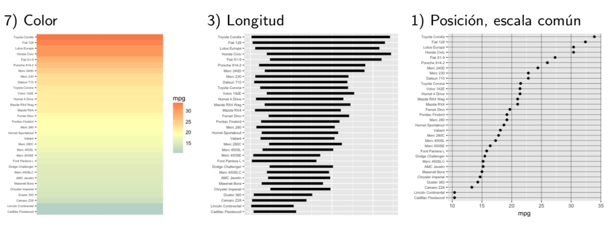

```{r,setup, include=FALSE}
knitr::opts_chunk$set(warning = FALSE, message = FALSE)
#xaringan::summon_remark()
library(tidyverse)
```

## Objetivos de la sesión

Esta sesión se divide en dos:

**Primera parte**:

- Utilizar nociones básicas de datos ordenados para la manipulación de `data frames`.

--

**Segunda parte**:

- Conocer nociones básicas para la creación de gráficos claros y precisos.

- Graficar datos usando el paquete `ggplot2`.

--

En esta sesión trabajaremos con los datos del **Señor de los Anillos**, **ENUSC 2017** y la *data frame* del paquete `gapminder`.

---

background-image: url(https://media.giphy.com/media/3ELDuBKag7o8E/giphy.gif)
background-size: cover
class: center, bottom, inverse

# Datos ordenados

---

## Datos ordenados


.pull-left[
> "In my experience the vast majority of graphing agony is due to insufficient data wrangling".

> "Behind every great plot there's a great deal of wrangling"

]

.pull-right[

]

---

## Datos ordenados

Algunas reglas a considerar (de acuerdo a Jenny Bryan):

.pull-left[
- Usa `data.frames`

- Se el jefe de tus factores

- Manten tus datos ordenados

- Reestructura tus datos
]

--

.pull-right[
- ¡Hecho!

- `forcats` 🐈

- ¿?

- ¿?¿?
]

--

.center[Aún nos falta revisar cómo mantener nuestros datos ordenados y cómo reestructurarlos cuando sea necesario.
]

--

.center[
Antes de comenzar a ver gráficos, necesitamos conocer cómo mantener nuestros datos ordenados.]

---

## Datos ordenados

Las tablas de datos o *data frames* son la estructura de datos más usadas en estadísticas y ciencias sociales.

--

A pesar de su popularidad, trabajar con este tipo de datos muchas veces consume mucho de nuestro tiempo ⏳⏰

--

### ¿Por qué nos toma tanto tiempo ordenar datos?

--

Porque hay muchas maneras de ~~ser desordenado~~ representar la información contenida en una tabla de datos.

???
Algunos dicen que pasamos un 80% de nuestro tiempo ordenando nuestros datos, y un 20% quejándonos porque tenemos que ordenar.

---

## Datos ordenados

`Tidyverse` tiene varias herramientas para lidiar con esta heterogeneidad.


--

Pero, ¿qué significa  ordenar nuestros datos?

---

## Datos ordenados

En términos sencillos, el concepto de datos ordenados (*tidy data*) puede ser descrito en base a 3 principios:

--

- Cada variable forma una columna.

--

- Cada observación forma una fila.

--

- Cada valor debe tener su propia celda.

--

[Wickham, H, (2014). *Tidy data*. Journal of Statistical Software ](https://www.google.com/url?sa=t&rct=j&q=&esrc=s&source=web&cd=1&ved=2ahUKEwjj7vHk6MPgAhXxY98KHSfyBIYQFjAAegQIBxAC&url=https%3A%2F%2Fwww.jstatsoft.org%2Farticle%2Fview%2Fv059i10%2Fv59i10.pdf&usg=AOvVaw2vJ6CHw9RT8m_noVUfoeP6)


---

## Datos ordenados

**¿Y qué nos ofrece `tidyverse` cuando los datos no vienen ordenados?** (O no están ordenados como yo quiero).

--

Veamos un ejemplo concreto. Obviamente no es representativo de la inmensa diversidad de problemas que nos enfrentamos para ordenar los datos...

--

Este ejemplo es prestado de las clases de Jenny Bryan: [Data wrangling, exploration, and analysis with R](https://stat545.com/index.html)

--

### *Data frame*: El Señor de los Anillos

.center[

]

---

## El Señor de los Anillos

Tenemos la siguiente información para cada película de la trilogía de Tolkien separada en 3 tablas:

```{r, fig.align='center', echo=FALSE}
knitr::include_graphics("thelord.png")
```

En cada tabla tenemos el número total de palabras dichas por cada personaje, separado por raza y sexo.

--

¿Qué sucede si queremos saber el número total de palabras dichas por hobbits de sexo masculino? 

¿O si queremos saber si una raza domina en una película?

---

## El Señor de los Anillos

```{r, fig.align='center', echo=FALSE}
knitr::include_graphics("thelord.png")
```

En realidad es muy sencillo, solo tendríamos que sumar las celdas... Pero si luego queremos graficar los datos utilizando un paquete estadístico como SPSS o Stata, ya no es tan intuituva la respuesta.

--

¡Tenemos que ordenar los datos!

---

```{r}
comunidad <- tribble(
  ~race, ~female, ~male,
  "Elf", 1229, 971,
  "Hobbit", 14, 3644,
  "Man", 0, 1995)
comunidad <- add_column(comunidad, film = 
            "The Fellowship Of The Ring", .before = "race")

dos_torres <- tribble(
  ~race, ~female, ~male,
  "Elf", 331, 513,
  "Hobbit", 0, 2463,
  "Man", 401, 3589)
dos_torres <- add_column(dos_torres, film = 
             "Two Towers", .before = "race")

retorno_rey <- tribble(
  ~race, ~female, ~male,
  "Elf", 183, 510,
  "Hobbit", 2, 2673,
  "Man", 268, 2459)
retorno_rey <- add_column(retorno_rey, film = 
              "The Return Of The King", .before = "race")

the_lord_of_the_rings <- rbind(
  comunidad, dos_torres, retorno_rey)
```

---

## El Señor de los Anillos

¿Cómo debería verse esta tabla para que estuviese ordenada?

--

**Pista**: ¿Qué es *male* y *female*? ¿Son variables?

--

Las columnas *male* y *female* son valores, no son variables.

Es necesario reunir esos valores para formar una columna que si corresponda a una variable.

--

Esto se vería más o menos así:

```{r, echo=FALSE}
head(the_lord_of_the_rings %>% gather(female:male, key = "sex", value = "words"), 6)
```

Veamos como hacemos esto con código.

---

background-image: url(https://d33wubrfki0l68.cloudfront.net/5f8c22ec53a1ac61684f3e8d59c623d09227d6b9/b15de/images/hex-tidyr.png)
background-size: 75px
background-position: 93% 8%

## `tidyr::gather`

`gather` permite reunir la información de distintas columnas, para formar un nuevo par de variables ordenado.

--

Para utilizar la función debemos:

- Identificar qué columnas queremos reordenar.

- Definir un nombre para la variable cuyos valores ahora son los nombres de las columnas que queremos reorganizar.

- Definir un nombre para los valores que están bajo esas columnas.

--

Con esto tenemos los principales parámetros de la función `gather`

```{r, echo=TRUE, include=TRUE}
str(tidyr::gather)
```

---

background-image: url(https://d33wubrfki0l68.cloudfront.net/5f8c22ec53a1ac61684f3e8d59c623d09227d6b9/b15de/images/hex-tidyr.png)
background-size: 75px
background-position: 93% 8%

## `tidyr::gather`

```{r, eval=FALSE, echo=TRUE}
the_lord_of_the_rings  %>% 
  gather(female:male, key = "sex", value = "words")
```

```{r, echo=FALSE, include=TRUE}
head(gather(data = the_lord_of_the_rings, female:male, key = "sex", value = "words"), 10)
the_lord_of_the_rings <- the_lord_of_the_rings %>% 
  gather(female:male, key = "sex", value = "words")
```

---

background-image: url(https://d33wubrfki0l68.cloudfront.net/5f8c22ec53a1ac61684f3e8d59c623d09227d6b9/b15de/images/hex-tidyr.png)
background-size: 75px
background-position: 93% 8%

## mini-taller 1

¡Ahora Uds! ¿Cómo reordenarían la siguiente tabla con `gather()`?

```{r}
table4a
```

**¡Para que el código funcione!**: Es necesario escribir 1999 y 2000 como sigue:

```{r, eval=FALSE}
`1999`
`2000`
```

Las `tibbles` admiten como nombre de variables caracteres que no son válidos para los `data.frame`. Es por esto que los números pueden ser nombres de variables.


---

background-image: url(https://d33wubrfki0l68.cloudfront.net/5f8c22ec53a1ac61684f3e8d59c623d09227d6b9/b15de/images/hex-tidyr.png)
background-size: 75px
background-position: 93% 8%

## mini-taller 1 - Solución

```{r}
table4a %>%
  gather(`1999`, `2000`, key = "year", value = "cases")
```

--


---

background-image: url(https://d33wubrfki0l68.cloudfront.net/5f8c22ec53a1ac61684f3e8d59c623d09227d6b9/b15de/images/hex-tidyr.png)
background-size: 75px
background-position: 93% 8%

## `tidyr::spread`

La función `spread()` es opuesta a la función `gather()`. 

--

A diferencia de `gather()`, `spread()` se utiliza cuando una observación está repartida en diferentes filas.

--

```{r}
table2
```

---

background-image: url(https://d33wubrfki0l68.cloudfront.net/5f8c22ec53a1ac61684f3e8d59c623d09227d6b9/b15de/images/hex-tidyr.png)
background-size: 75px
background-position: 93% 8%

## `tidyr::spread`

¿Usemos `spread()` para "desordenar" los datos que ordenamos del Señor de los Anillos?

--

La función `spread()` necesita de dos paramétros:

- La columna que contiene los nombres de las variables (`key`).

- La columna que contiene los valores de distintas variables (`value`).

**¿Cómo lo harían para tener una variable por raza?**

```{r, eval=FALSE}
the_lord_of_the_rings %>%
  spread(key = ..., value = ...)
```

--

```{r, eval=FALSE}
the_lord_of_the_rings %>%
  spread(key = "race", value = "words")
```

---

background-image: url(https://raw.githubusercontent.com/allisonhorst/stats-illustrations/master/rstats-artwork/ggplot2_masterpiece.png)
background-size: cover
class: center, bottom, inverse

# ¡Ahora sí podemos pasar a los gráficos!

---

## La importancia de la visualización

La visualización juega un rol importante en las etapas del análisis de datos:

- Exploración

- Modelamiento

- Diagnóstico

--

> "The simple graph has brought more information to the data analyst's mind than any other device." - John Tukey

--

**Los gráficos nos permiten comunicar y atraer la atención de una audiencia**: [The Joy of Stats](https://www.youtube.com/watch?v=V8lbiiTF2P0)

???
Los principales objetivos de los gráficos en estadística son: 
i) facilitar comparaciones
ii) identificar tendencias

---

## The Datasaurus Dozen [Matejka & Fitzmaurice, 2017](https://www.autodeskresearch.com/publications/samestats)

.center[

]

---

## No todas las visualizaciones son igual de efectivas

--


---

## No todas las visualizaciones son igual de efectivas


---

## Visualización efectiva

Los gráficos requieren de nuestra capacidad visual para interpretar figuras geométricas.

--

[Cleveland & McGuill (1985)](https://www.jstor.org/stable/2288400?seq=1#page_scan_tab_contents)

- Las mejores visualizaciones son aquellas que requieren el uso de la "visión instantánea".

- Y no requieren de un esfuerzo visual para ser comprendidas.

--

.center[La "visión instantánea" nos permite evaluar visualmente **patrones geométricos** y dimensionar **magnitudes**]

---

## Visualización efectiva

Cleveland ordena la dificultad de los elementos gráficos basado en la percepción para estimar variables cuantitativas.

--

De menor a mayor dificultad:

- **Posición** a lo largo de una escala común
- **Posición** en escalas no alineadas pero idénticas
- Longitud
- Ángulo o pendiente
- Área
- Volumen, densidad o saturación del color
- Tono del color

---

## Visualización efectiva

```{r, out.width = "700px", out.height="290px" , fig.align='center', echo=FALSE}

```

---

## Las tortas son para comer...

--

## [*Three reasons that pie charts suck*](https://www.richardhollins.com/blog/why-pie-charts-suck/)

.pull-left[

1. Son malos para comunicar lo básico, a menos que tengan etiquetas.

2. No son buenos para mostrar tendencias (aun cuando lo acompañen etiquetas).

3. No sirven para mostrar tendencias cuando se utilizan valores absolutos.
]

.pull-right[
]

---

## Principios generales (para hacer malos gráficos)

- Muestra la menor cantidad de información posible (no es posible leer el gráfico sin leer el texto que lo acompaña).

--

- Confunde a los demás respecto a lo que quieres mostrar (con etiquetas que no explican nada o características que no agregan información).

--

- Usa un gráfico de torta (con efectos 3d).

--

- Si comparas más de un gráfico, ojalá utiliza distintas escalas.

---

## Gráficos en R

R tiene distintos paquetes de visualización de datos (`ggplot2`, `lattice`).

--

Pero, ¿por qué usarlas? R base tiene funciones para hacer gráficos sin necesidad de llamar a otros paquetes:

```{r pressure, fig.align='center', fig.height=3.7, fig.width=3.7, echo=TRUE}
plot(pressure)
```

---

## Gráficos en R

A mayor tiempo invertido, la calidad de los gráficos de `ggplot2` y `lattice` es mucho mayor que la de los gráficos **R** base.

--

Paquetes como `ggplot` siguen una gramática coherente, lo que facilita su aprendizaje. Además, con poco esfuerzo (aunque más código) se obtienen rápidamente mejores resultados.

--

```{r, fig.align='center', fig.height=3.7, fig.width=3.7, echo=TRUE}
ggplot(data = pressure) + 
          geom_point(mapping = aes(x = temperature, y = pressure))
```

---

background-image: url(https://d33wubrfki0l68.cloudfront.net/0ab849ed51b0b866ef6895c253d3899f4926d397/dbf0f/images/hex-ggplot2.png)
background-size: 75px
background-position: 93% 8%

## `ggplot2`

`ggplot2` fue desarrollado sobre la base de la "gramática de los gráficos":

--

- Un **sistema coherente** para describir y construir gráficos.

--

Una buena gramática permite **descifrar** de manera fácil gráficos complicados:

- Facilita la programación de estos.

- Es más sencillo reutilizar el código para resolver otros problemas.

--

Bajo esta gramática los gráficos pueden ser descompuestos en un conjunto de parámetros o capas, las que servirían para describir a *cualquier* gráfico.

---

background-image: url(https://d33wubrfki0l68.cloudfront.net/0ab849ed51b0b866ef6895c253d3899f4926d397/dbf0f/images/hex-ggplot2.png)
background-size: 75px
background-position: 93% 8%

## Gramática de los gráficos

Independiente del gráfico, siempre se necesitarán los mismos elementos para construir uno:

- Datos (`data`)
- Propiedades estéticas (`aes`)
- Objeto geométrico (`geom`)
- Transformaciones estadísticas (`stat`)
- Escala (`scale`)
- Sistema de coordenadas (`coord`)
- Facetas (`facet`)

--

Puede decirse que el código de `ggplot2` funciona agregando capas.

---

background-image: url(https://d33wubrfki0l68.cloudfront.net/0ab849ed51b0b866ef6895c253d3899f4926d397/dbf0f/images/hex-ggplot2.png)
background-size: 75px
background-position: 93% 8%

## Gramática de los gráficos

Si bien no aprenderemos *exactamente* como se hace cada gráfico, sí intentaremos conocer que es lo básico que tiene que tener *cualquiera* de estos.

--

La gramática que veremos se puede representar de la siguiente manera:

```{r, echo=TRUE, eval=FALSE}
ggplot(data = <DATA>) + 
  <GEOM_FUNCTION>(
     mapping = aes(<MAPPINGS>),
     stat = <STAT>, 
     position = <POSITION>
  ) +
  <FACET_FUNCTION> +
  <SCALE_FUNCTION> +
  <THEME_FUNCTION>
```

---

background-image: url(https://d33wubrfki0l68.cloudfront.net/0ab849ed51b0b866ef6895c253d3899f4926d397/dbf0f/images/hex-ggplot2.png)
background-size: 75px
background-position: 93% 8%

## 1er elemento de esta gramática: ¡Datos!

### `gapminder` 

Base de datos de Gapminder.org. Contiene información sobre la esperanza de vida, PIB per cápita 
 y población desde 1952 a 2007
 
```{r}
library(gapminder)
```

Anteriormente vimos que una manera de representar la relación entre PIB per cápita y esperanza de vida era a través de un gráfico de dispersión de puntos con dos ejes. 

¿Cómo se construiría este gráfico?

---

background-image: url(https://d33wubrfki0l68.cloudfront.net/0ab849ed51b0b866ef6895c253d3899f4926d397/dbf0f/images/hex-ggplot2.png)
background-size: 75px
background-position: 93% 8%

## mini-taller 2

Completa lo que falta en el espacio ocupado por los puntos suspensivos.

```{r, echo=TRUE, eval=FALSE}
ggplot(data = ...) +
 geom_point(mapping = aes(x = ..., y = ...))
```

---

background-image: url(https://d33wubrfki0l68.cloudfront.net/0ab849ed51b0b866ef6895c253d3899f4926d397/dbf0f/images/hex-ggplot2.png)
background-size: 75px
background-position: 93% 8%


## mini-taller 2 - Solución

```{r, echo=TRUE, fig.height=4, fig.align='center'}
ggplot(data = gapminder) +
 geom_point(mapping = aes(x = gdpPercap, y = lifeExp))
```

---

background-image: url(https://d33wubrfki0l68.cloudfront.net/0ab849ed51b0b866ef6895c253d3899f4926d397/dbf0f/images/hex-ggplot2.png)
background-size: 75px
background-position: 93% 8%

## Los primeros elementos de esta gramática

```{r, echo=TRUE, eval=FALSE}
ggplot(data = gapminder) +
 geom_point(mapping = aes(x = gdpPercap, y = lifeExp))
```

**`ggplot`**: crea un sistema de cordenadas al que se le pueden ir agregando capas. El primer argumento de `ggplot()` son los datos para usar en el gráfico (`ggplot(data = gapminder)`.

--

**`geom`**: elementos geométricos (puntos, líneas, rectángulos, texto, etc).

Cada función `geom` toma un argumento de `mapping`. Este define cómo las variables en el conjunto de datos son mapeadas a elementos gráficos (i.e. especifica lo que vemos en el gráfico: puntos, líneas, barras, etc).

--

**`aes`**: propiedad visual de los objetos en el gráfico. Los argumentos `x` e `y` de `aes` especifican cuales variables mapear en los ejes *x* e *y* del gráfico.

---

background-image: url(https://d33wubrfki0l68.cloudfront.net/0ab849ed51b0b866ef6895c253d3899f4926d397/dbf0f/images/hex-ggplot2.png)
background-size: 75px
background-position: 93% 8%

## `gapminder`

Para visualizar mejor la relación entre la riqueza de los países y su esperanza de vida transformemos logarítmicamente la variable PIB per cápita. 

```{r, echo=TRUE, eval=FALSE}
ggplot(data = gapminder) +
 geom_point(mapping = aes(x = log10(gdpPercap), y = lifeExp))
```

¿Cómo creen que se verá ahora el gráfico?

---

background-image: url(https://d33wubrfki0l68.cloudfront.net/0ab849ed51b0b866ef6895c253d3899f4926d397/dbf0f/images/hex-ggplot2.png)
background-size: 75px
background-position: 93% 8%

## `gapminder`

```{r, fig.height=4, fig.align='center'}
ggplot(data = gapminder) +
 geom_point(mapping = aes(x = log10(gdpPercap), y = lifeExp))
```

---

background-image: url(https://d33wubrfki0l68.cloudfront.net/0ab849ed51b0b866ef6895c253d3899f4926d397/dbf0f/images/hex-ggplot2.png)
background-size: 75px
background-position: 93% 8%


## Elementos estéticos (*Aesthetic*)

Decíamos que los elementos estéticos corresponden a propiedades visuales de nuestro gráfico. Estos permiten mapear variables en propiedades estéticas que podemos ver.

Algunas propiedades de los elementos son: `size`, `colour`, `shape`.

--

Por ejemplo, imaginemos que nos interesa identificar por color los distintos continentes en el gráfico (`continent`).

```{r, echo=TRUE, eval=FALSE}
# ¿Qué falta donde estan los "..."?
ggplot(data = gapminder) +
 geom_point(mapping = aes(x = log10(gdpPercap), y = lifeExp, 
                          colour = ...))
```

---

background-image: url(https://d33wubrfki0l68.cloudfront.net/0ab849ed51b0b866ef6895c253d3899f4926d397/dbf0f/images/hex-ggplot2.png)
background-size: 75px
background-position: 93% 8%

## Elementos estéticos (*Aesthetic*)

```{r, fig.height=4, fig.align='center'}
# alpha controla la transparencia
ggplot(data = gapminder) +
 geom_point(mapping = aes(x = log10(gdpPercap), 
                      y = lifeExp, 
                     colour = continent, alpha = (1/3)))
```


---

background-image: url(https://d33wubrfki0l68.cloudfront.net/0ab849ed51b0b866ef6895c253d3899f4926d397/dbf0f/images/hex-ggplot2.png)
background-size: 75px
background-position: 93% 8%

## Elementos estéticos (*Aesthetic*)

Para mapear una propiedad estética a una variable, es necesario asociar el nombre de esta propiedad a la variable dentro del argumento `aes()`. 

--

`ggplot` automáticamente asignará un valor único a la propiedad estética (en este caso un único color) a cada valor único de la variable. Este proceso es conocido como *scaling* (escalamiento).

--

También es posible fijar una propiedad estética de manera manual a cada `geom`. Por ejemplo, se podría hacer que todos los puntos del gráfico fueran rojos.

???
Por defecto se agrega una leyenda que relaciona qué niveles de la propiedad estética corresponden a cada valor.

---

background-image: url(https://d33wubrfki0l68.cloudfront.net/0ab849ed51b0b866ef6895c253d3899f4926d397/dbf0f/images/hex-ggplot2.png)
background-size: 75px
background-position: 93% 8%

## Elementos estéticos (*Aesthetic*)

```{r, echo=TRUE, fig.height=4, fig.align='center'}
ggplot(data = gapminder) +
 geom_point(mapping = aes(x = log10(gdpPercap), y = lifeExp), 
                          colour = "red")
```

¿Notan una diferencia con el código del gráfico anterior?

---

background-image: url(https://d33wubrfki0l68.cloudfront.net/0ab849ed51b0b866ef6895c253d3899f4926d397/dbf0f/images/hex-ggplot2.png)
background-size: 75px
background-position: 93% 8%

## Elementos estéticos (*Aesthetic*)

En este caso el color no reporta información sobre alguna variable, sino que sólo cambia la apariencia del gráfico.

Para fijar un parámetro estético de manera manual se debe dejar este como un argumento de la función `geom`, y no de la función `aes()`.

--

### mini-taller 3

¿Qué ocurre si vinculas una propiedad estética a algo como `aes(colour = pop > mean(pop))`?

---

background-image: url(https://d33wubrfki0l68.cloudfront.net/0ab849ed51b0b866ef6895c253d3899f4926d397/dbf0f/images/hex-ggplot2.png)
background-size: 75px
background-position: 93% 8%

## mini-taller 3

```{r, fig.height=4, fig.align='center'}
ggplot(data = gapminder) +
 geom_point(mapping = aes(x = log10(gdpPercap), y = lifeExp, 
                          colour = pop > mean(pop)))
```

--

Para entender mejor el código, puedes desglosarlo. Corre, por ejemplo, `gapminder$pop > mean(gapminder$pop)`. 

---

background-image: url(https://d33wubrfki0l68.cloudfront.net/0ab849ed51b0b866ef6895c253d3899f4926d397/dbf0f/images/hex-ggplot2.png)
background-size: 75px
background-position: 93% 8%

## mini-taller 3 - Solución

`R` resuelve este código el que corresponde a un vector con valores lógicos (`TRUE` y `FALSE`).

En este gráfico se diferencia por color entre aquellos países que en determinado año tuvieron una población mayor al promedio mundial, respecto de los que no cumplen esta condición.

---

background-image: url(https://d33wubrfki0l68.cloudfront.net/0ab849ed51b0b866ef6895c253d3899f4926d397/dbf0f/images/hex-ggplot2.png)
background-size: 75px
background-position: 93% 8%

## no tan mini-taller 4

¿Cómo representarías en el gráfico la relación entre PIB per cápita, esperanza de vida y tamaño de la población?

Pista: ¿Qué otras propiedades estéticas encontramos en `aes()`?

*¡5 minutos!*

---

background-image: url(https://d33wubrfki0l68.cloudfront.net/0ab849ed51b0b866ef6895c253d3899f4926d397/dbf0f/images/hex-ggplot2.png)
background-size: 75px
background-position: 93% 8%

## no tan mini-taller 4 - Solución


```{r, echo=TRUE, fig.height=4, fig.align='center'}
ggplot(data = gapminder) +
 geom_point(mapping = aes(x = log10(gdpPercap), y = lifeExp, 
                    size = pop, colour = continent, alpha = 1/3))
```

---

background-image: url(https://d33wubrfki0l68.cloudfront.net/0ab849ed51b0b866ef6895c253d3899f4926d397/dbf0f/images/hex-ggplot2.png)
background-size: 75px
background-position: 93% 8%

## `ggplot2`: Gráficos como objetos

A diferencia de los gráficos creados con `R` base, los gráficos creados con `ggplot2` se pueden guardar como objeto.

```{r, echo=TRUE}
esperanza_pib <- ggplot(data = gapminder) +
 geom_point(mapping = aes(x = log10(gdpPercap), y = lifeExp, 
                          size = pop, colour = continent, alpha = 1/3))
```

---

background-image: url(https://d33wubrfki0l68.cloudfront.net/0ab849ed51b0b866ef6895c253d3899f4926d397/dbf0f/images/hex-ggplot2.png)
background-size: 75px
background-position: 93% 8%

## `ggplot2`: Gráficos como objetos

Para verlo es necesario imprimirlo.

```{r, echo=TRUE, fig.align='center', fig.height=4}
esperanza_pib
```

---

background-image: url(https://d33wubrfki0l68.cloudfront.net/0ab849ed51b0b866ef6895c253d3899f4926d397/dbf0f/images/hex-ggplot2.png)
background-size: 75px
background-position: 93% 8%

## `ggplot2`: Gráficos como objetos

Esto significa que no tenemos que agregar desde un principio todas las características que queremos para nuestro gráfico.

Podemos ir construyéndolo de a poco, sobreescribiendo el objeto inicial, lo que finalmente puede resultar en un código más ordenado y fácil de entender.

```{r, echo=TRUE, eval=FALSE}
esperanza_pib <- esperanza_pib + geom(...) + scale_x_continuous(...)
```

---

background-image: url(https://d33wubrfki0l68.cloudfront.net/0ab849ed51b0b866ef6895c253d3899f4926d397/dbf0f/images/hex-ggplot2.png)
background-size: 75px
background-position: 93% 8%

## Transformaciones estadísticas (`Stat`)

**`stat`**: Comúnmente representa un resumen estadístico de estos. Un ejemplo de `stat` es `smooth`, la que implica una media condicional suavizada de *y* dado *x*

--

Cada `geom` tiene un `stat` por defecto, por lo que muchas veces no tendremos que indicarlo en nuestro código (`R` ya "sabe" qué hacer, aunque esto no siempre es lo que queremos ver en nuestro gráfico...).

--

En el caso del gráfico de dispersión que estamos usando el `stat` por defecto es `identity`. ¿A qué crees que se refiera?

```{r, eval=FALSE}
geom_point(mapping = aes(...), stat = "identity")
```

---

background-image: url(https://d33wubrfki0l68.cloudfront.net/0ab849ed51b0b866ef6895c253d3899f4926d397/dbf0f/images/hex-ggplot2.png)
background-size: 75px
background-position: 93% 8%

## Transformaciones estadísticas (`Stat`)

`stat = "identity"` implica que los datos que se representan en el gráfico corresponden exactamente a los datos que tenemos en nuestra base de datos.

--

En este caso, lo que queremos ver es cómo se ubican los países (como puntos en un gráfico) de acuerdo a un sistema de coordenadas definido por los valores de `x = log10(PIB per cápita)` e `y = Esperanza de vida` que tenemos originalmente en nuestros datos.

¿Qué pasa si queremos ver ahora la media condicional suavizada de *y* dado *x*?

---

background-image: url(https://d33wubrfki0l68.cloudfront.net/0ab849ed51b0b866ef6895c253d3899f4926d397/dbf0f/images/hex-ggplot2.png)
background-size: 75px
background-position: 93% 8%

## Transformaciones estadísticas (`Stat`)

`geom_smooth` es otra manera de especificar qué queremos ver en un gráfico. Particularmente, nos permite ver si existe algún patrón en la distribución de dos variables.

La transformación estadística que utiliza es `smooth`, la que por defecto ajusta a los datos un modelo aditivo generalizado (GAM).

--

¡Estos valores no están originalmente en nuestros datos!

Este `stat` permite calcular nuevos valores para nuestro gráfico. 

---

background-image: url(https://d33wubrfki0l68.cloudfront.net/0ab849ed51b0b866ef6895c253d3899f4926d397/dbf0f/images/hex-ggplot2.png)
background-size: 75px
background-position: 93% 8%

## Transformaciones estadísticas (`Stat`)

```{r, echo=TRUE, fig.align='center', fig.height=4.5}
ggplot(data = gapminder) +
 geom_point(mapping = aes(x = log10(gdpPercap), y = lifeExp,
                          colour = continent, size = pop)) + 
  geom_smooth(mapping = aes(x = log10(gdpPercap), y = lifeExp))
```

---

background-image: url(https://d33wubrfki0l68.cloudfront.net/0ab849ed51b0b866ef6895c253d3899f4926d397/dbf0f/images/hex-ggplot2.png)
background-size: 75px
background-position: 93% 8%

## Transformaciones estadísticas (`Stat`)

`geom_smooth` utiliza `stat_smooth` por defecto.

`stat_smooth` también puede ser un argumento de nuestro gráfico, el cual también tiene por defecto un `geom`.

--

Gracias a esta característica, muchas veces se puede usar `geom` o `stat` de manera intercambiable.

```{r, eval=FALSE}
ggplot(data = gapminder) +
 geom_point(mapping = aes(x = log10(gdpPercap), y = lifeExp,
                          colour = continent, size = pop)) + 
  stat_smooth(mapping = aes(x = log10(gdpPercap), y = lifeExp))
```

---

background-image: url(https://d33wubrfki0l68.cloudfront.net/0ab849ed51b0b866ef6895c253d3899f4926d397/dbf0f/images/hex-ggplot2.png)
background-size: 75px
background-position: 93% 8%

## Transformaciones estadísticas (`Stat`)

```{r, echo=FALSE, fig.align='center', fig.height=6, warning=FALSE, message=FALSE}
ggplot(data = gapminder) +
 geom_point(mapping = aes(x = log10(gdpPercap), y = lifeExp,
                          colour = continent, size = pop)) + 
  stat_smooth(mapping = aes(x = log10(gdpPercap), y = lifeExp))
```

???
Es posible cambiar el método de ajuste con el argumento `method` de `geom_smooth`.
ggplot(data = gapminder) +
 geom_point(mapping = aes(x = log10(gdpPercap), y = lifeExp,
                          colour = continent, size = pop)) + 
  stat_smooth(mapping = aes(x = log10(gdpPercap), y = lifeExp), 
              method = "lm")
              
---

background-image: url(https://d33wubrfki0l68.cloudfront.net/0ab849ed51b0b866ef6895c253d3899f4926d397/dbf0f/images/hex-ggplot2.png)
background-size: 75px
background-position: 93% 8%

## Elementos geométricos (`Geom`)

Hasta ahora hemos visto dos: `geom_point` y `geom_smooth`. Pero existen muchos más:

Alguno ejemplos son: 

- `geom_line`

- `geom_bar`

- `geom_density`

- `geom_boxplot`

- `geom_histogram`

- Y muchas [más](https://ggplot2.tidyverse.org/reference/)!

---

background-image: url(https://d33wubrfki0l68.cloudfront.net/0ab849ed51b0b866ef6895c253d3899f4926d397/dbf0f/images/hex-ggplot2.png)
background-size: 75px
background-position: 93% 8%

## Elementos geométricos (`Geom`)

Hasta ahora para mostrar diferentes objetos geométricos en un mismo gráfico, hemos agregado múltiples `geom` a la función `ggplot()`.

```{r, echo=TRUE, eval=FALSE}
ggplot(data = gapminder) +
 geom_point(mapping = aes(x = log10(gdpPercap), y = lifeExp,
                          colour = continent, size = pop)) + 
  geom_smooth(mapping = aes(x = log10(gdpPercap), y = lifeExp))
```

Sin embargo, esto hace que nuestro código sea un poco repetitivo.

--

En `ggplot` es posible fijar un conjunto de propiedades estéticas de manera global para todo un gráfico. Al mismo tiempo, se pueden agregar otras capas que utilicen otras propiedades e incluso otros datos.

```{r, echo=TRUE, eval=FALSE}
ggplot(data = gapminder, mapping = aes(x = log10(gdpPercap), 
                                       y = lifeExp)) +
 geom_point(mapping = aes(colour = continent, size = pop)) + 
  geom_smooth()
```

???
Cada especificación local (a nivel de `geom`) anula para esa capa las propiedades globales.
Las capas en este sentido son independientes entre sí.

---

background-image: url(https://d33wubrfki0l68.cloudfront.net/0ab849ed51b0b866ef6895c253d3899f4926d397/dbf0f/images/hex-ggplot2.png)
background-size: 75px
background-position: 93% 8%

## Gráficos de barras (`geom_bar`)

Aunque los gráficos de barra pueden parecer sencillos, resultan ser un ejemplo muy claro para entender la transformación estadística.

--

Para este ejemplo utilizaremos la **ENUSC 2017**.

```{r}
library(haven)
enusc <- read_sav("data/Base de Datos - XIV ENUSC 2017.sav") %>% 
  filter(Kish == 1) %>% 
  select(enc_region, rph_sexo, VP_DC, VA_DC, rph_edad, P13_1_1) %>% 
  mutate(sexo = haven::as_factor(rph_sexo),
         region = haven::as_factor(enc_region),
         vic_hog = haven::as_factor(VA_DC),
         edad = as.numeric(rph_edad))
```

---

background-image: url(https://d33wubrfki0l68.cloudfront.net/0ab849ed51b0b866ef6895c253d3899f4926d397/dbf0f/images/hex-ggplot2.png)
background-size: 75px
background-position: 93% 8%

## Gráficos de barras (`geom_bar`)

El siguiente gráfico muestra el total muestral de victimizados por sexo (Victimización personal).

```{r, echo=TRUE, fig.align='center', fig.height=4}
enusc %>% filter(VP_DC == 1) %>% 
ggplot() + 
  geom_bar(mapping = aes(x = sexo))
```

--

¿De donde proviene la variable `count`?

---

background-image: url(https://d33wubrfki0l68.cloudfront.net/0ab849ed51b0b866ef6895c253d3899f4926d397/dbf0f/images/hex-ggplot2.png)
background-size: 75px
background-position: 93% 8%

## Gráficos de barras (`geom_bar`)

Muchos gráficos, como los de dispersión, utilizan los valores en bruto de nuestros datos.

--

Otros tipos de gráficos calculan nuevos valores:

- Gráficos de barra, histogramas, compartimentan los datos y luego grafican cuantos casos caen en cada uno de estos compartimentos.

- Para los diagramas de caja (boxplots) se calcula un resumen estadístico de los datos, los que luego son graficados de acuerdo a un formato.


---

background-image: url(https://d33wubrfki0l68.cloudfront.net/0ab849ed51b0b866ef6895c253d3899f4926d397/dbf0f/images/hex-ggplot2.png)
background-size: 75px
background-position: 93% 8%

## Gráficos de barras (`geom_bar`)

Para saber que `stat` usa cada `geom` puedes revisar el valor por defecto, preguntando por ejemplo `?geom_bar` 

--

En algunos casos puede que quieras utilizar otro `stat` en vez del que viene por defecto.

--

background-image: url(https://d33wubrfki0l68.cloudfront.net/0ab849ed51b0b866ef6895c253d3899f4926d397/dbf0f/images/hex-ggplot2.png)
background-size: 75px
background-position: 93% 8%


### mini-taller 5

Utilizando el siguiente conjunto de datos, crea un gráfico similar al que ya vimos.

Este conjunto de datos tiene la variable `freq`, que indica el número total victimizados ppor sexo.

```{r, echo=TRUE}
demo <- tribble(
  ~sexo,        ~freq,
  "Hombre",     1059,
  "Mujer",      1608
)
```

---

background-image: url(https://d33wubrfki0l68.cloudfront.net/0ab849ed51b0b866ef6895c253d3899f4926d397/dbf0f/images/hex-ggplot2.png)
background-size: 75px
background-position: 93% 8%

## mini-taller 5 - Solución

```{r, fig.height=5}
ggplot(data = demo) +
  geom_bar(mapping = aes(x = sexo, y = freq), 
           stat = "identity")
```

---

background-image: url(https://d33wubrfki0l68.cloudfront.net/0ab849ed51b0b866ef6895c253d3899f4926d397/dbf0f/images/hex-ggplot2.png)
background-size: 75px
background-position: 93% 8%

## Gráficos de barras (`geom_bar`)

Otra manera de cambiar el seteo por defecto, es cambiar la variable calculada.

Para ver este aspecto de `geom_bar`, vamos a `?geom_bar` de la ayuda de `R`.

--

Cambiando en la variable y a `..prop..` es posible mostrar la proporción por grupo

```{r, echo=TRUE, fig.height=3.7}
enusc %>% filter(VP_DC == 1) %>% 
ggplot() +  
  geom_bar(mapping = aes(x = sexo, y = ..prop.., group = 1))
```

---

background-image: url(https://d33wubrfki0l68.cloudfront.net/0ab849ed51b0b866ef6895c253d3899f4926d397/dbf0f/images/hex-ggplot2.png)
background-size: 75px
background-position: 93% 8%

## Gráficos de barras (`geom_bar`)

¿Para qué sirve el argumento `group = 1`?

[R for Data Science Solutions](https://jrnold.github.io/r4ds-exercise-solutions/data-visualisation.html#exercise-3.7.4.)

[Respuesta en StackOverflow](https://stackoverflow.com/questions/39878813/ggplot-geom-bar-meaning-of-aesgroup-1/39879232#39879232)

--

Alguien más curioso también pudo haberse preguntado, y ¿por qué se usa `..prop..`? ¿Qué son esos puntos?

--

[Respuesta en StackOverflow](https://stackoverflow.com/questions/17502808/double-dots-in-a-ggplot)

---

background-image: url(https://d33wubrfki0l68.cloudfront.net/0ab849ed51b0b866ef6895c253d3899f4926d397/dbf0f/images/hex-ggplot2.png)
background-size: 75px
background-position: 93% 8%

## Gráficos de barras (`geom_bar`)

Para colorear un gráfico de barras se puede usar la propiedad visual `colour` o `fill`.

--
.pull-left[

```{r, fig.height=4}
ggplot(data = enusc) +  
  geom_bar(mapping = 
          aes(x = sexo,
          fill = vic_hog))
```
]

.pull-right[

```{r, fig.height=4}
ggplot(data = enusc) +  
  geom_bar(mapping = 
          aes(x = sexo,
          colour = vic_hog))
```
]

---

background-image: url(https://d33wubrfki0l68.cloudfront.net/0ab849ed51b0b866ef6895c253d3899f4926d397/dbf0f/images/hex-ggplot2.png)
background-size: 75px
background-position: 93% 8%

## Gráfico de barras

El apilamiento es la ejecutado por defecto por el ajuste de posición especificado por el argumento `position = stack`.

Existen otras para este tipo de gráficos: 

- `position = "fill"`

- `position = "dodge"`

(Existen más! Pero no todas aplican para los gráficos de barra. Ej. `position = "jitter"` para `geom_point`).

---

background-image: url(https://d33wubrfki0l68.cloudfront.net/0ab849ed51b0b866ef6895c253d3899f4926d397/dbf0f/images/hex-ggplot2.png)
background-size: 75px
background-position: 93% 8%

## mini-taller 6

Revisa qué hace cada uno de ajustes de posición para el gráfico anterior (`?geom_bar`).

A continuación, el código para partir:

```{r, echo=TRUE, eval=FALSE}
ggplot(data = enusc) +  
  geom_bar(mapping = aes(x = sexo, fill = vic_hog),
           position = ...)
```

---

background-image: url(https://d33wubrfki0l68.cloudfront.net/0ab849ed51b0b866ef6895c253d3899f4926d397/dbf0f/images/hex-ggplot2.png)
background-size: 75px
background-position: 93% 8%

## mini-taller 6 - Solución

- `position = "fill"`: es como el apilamiento, pero hace que cada barra apilada tenga la misma altura. 

```{r, echo=TRUE, fig.height=3.2}
ggplot(data = enusc) +  
  geom_bar(mapping = aes(x = sexo, fill = vic_hog),
           position = "fill")
```

---

background-image: url(https://d33wubrfki0l68.cloudfront.net/0ab849ed51b0b866ef6895c253d3899f4926d397/dbf0f/images/hex-ggplot2.png)
background-size: 75px
background-position: 93% 8%

## mini-taller 6 - Solución

- `position = "dodge"`: ubica los objetos uno al lado del otro. 

```{r, echo=TRUE, fig.height=3.2}
ggplot(data = enusc) +  
  geom_bar(mapping = aes(x = sexo, fill = vic_hog),
           position = "dodge")
```

---

background-image: url(https://d33wubrfki0l68.cloudfront.net/0ab849ed51b0b866ef6895c253d3899f4926d397/dbf0f/images/hex-ggplot2.png)
background-size: 75px
background-position: 93% 8%

## Escalas (`scales`)

Hasta ahora con los argumentos `mapping = aes()` solamente hemos especificado que una variable debe ser mapeada a un elemento estético.

--

No le hemos dicho a `R` cómo hacer específicamente esta transformación.

Ej. En los gráficos anteriores no hemos dicho en ningún caso qué mínimo y máximo usar en los ejes *x* e *y*, en qué puntos deben aparecer las etiquetas en los ejes, cuál es el título de cada eje, etc.

--

La conversión entre las unidades en que vienen los datos (pesos, sexo, etc.) a unidades gráficas se denomina escalado, y es realizada por los argumentos `scales`.

--

Los siguientes argumentos son los más comunes entre las escalas de `ggplot2`:

- **`name`**: argumento que da el nombre al eje o el título de la leyenda.
- **`limits`**: mínimo y máximo de una escala.
- **`breaks`**: los puntos a lo largo de la escala donde las etiquetas deben aparecer.
- **`labels`**: las etiquetas que deberían aparecer en cada corte.

---

background-image: url(https://d33wubrfki0l68.cloudfront.net/0ab849ed51b0b866ef6895c253d3899f4926d397/dbf0f/images/hex-ggplot2.png)
background-size: 75px
background-position: 93% 8%

## Escalas (`scales`)

¿Se acuerdan de este gráfico?

```{r, echo=TRUE, fig.align='center', fig.height=5}
ggplot(data = gapminder, mapping = aes(x = log10(gdpPercap), 
                                       y = lifeExp)) +
 geom_point(mapping = aes(colour = continent, size = pop)) 
```

Especifiquemos con más claridad cómo cada variable debe ser mapeada como un elemento estético.

---

background-image: url(https://d33wubrfki0l68.cloudfront.net/0ab849ed51b0b866ef6895c253d3899f4926d397/dbf0f/images/hex-ggplot2.png)
background-size: 75px
background-position: 93% 8%

## Escalas (`scales`)

```{r, echo=TRUE, fig.align='center', fig.height=5}
ggplot(data = gapminder, mapping = aes(x = gdpPercap, y = lifeExp)) +
 geom_point(mapping = aes(colour = continent, size = pop)) + 
  scale_x_log10(name = "PIB per capita") + #<<
  scale_y_continuous(name = "Esperanza de vida", #<<
                     breaks = seq(20,90,10)) #<<
```

---

background-image: url(https://d33wubrfki0l68.cloudfront.net/0ab849ed51b0b866ef6895c253d3899f4926d397/dbf0f/images/hex-ggplot2.png)
background-size: 75px
background-position: 93% 8%

## Pequeño bonus: *Themes*

Hay distintos temas para elegir. Para un lista, click [aquí](https://ggplot2.tidyverse.org/reference/ggtheme.html)

```{r, echo=TRUE, fig.align='center', fig.height=4.5}
ggplot(data = gapminder, mapping = aes(x = gdpPercap, y = lifeExp)) +
 geom_point(mapping = aes(colour = continent, size = pop)) + 
  scale_x_log10(name = "PIB per capita") + 
  scale_y_continuous(name = "Esperanza de vida") +
  theme_classic() #<<
```


---

background-image: url(https://d33wubrfki0l68.cloudfront.net/0ab849ed51b0b866ef6895c253d3899f4926d397/dbf0f/images/hex-ggplot2.png)
background-size: 75px
background-position: 93% 8%

## Pequeño bonus: *Facets*

```{r, echo=TRUE, fig.align='center', fig.height=4.5}
ggplot(data = gapminder, mapping = aes(x = gdpPercap, y = lifeExp, 
                                       colour = country)) +
 geom_point(aes(size = pop), show.legend = FALSE) + 
  scale_colour_manual(values = country_colors) +
  scale_x_log10(name = "PIB per capita") + 
  scale_y_continuous(name = "Esperanza de vida") +
   facet_wrap(~continent) #<<
```

---

background-image: url(https://d33wubrfki0l68.cloudfront.net/0ab849ed51b0b866ef6895c253d3899f4926d397/dbf0f/images/hex-ggplot2.png)
background-size: 75px
background-position: 93% 8%

## Gramática de los gráficos

¿Hace un poco más de sentido?

```{r, echo=TRUE, eval=FALSE}
ggplot(data = <DATA>) + 
  <GEOM_FUNCTION>(
     mapping = aes(<MAPPINGS>),
     stat = <STAT>, 
     position = <POSITION>
  ) +
  <FACET_FUNCTION> +
  <SCALE_FUNCTION> +
  <THEME_FUNCTION>
```

---

background-image: url(https://d33wubrfki0l68.cloudfront.net/0ab849ed51b0b866ef6895c253d3899f4926d397/dbf0f/images/hex-ggplot2.png)
background-size: 75px
background-position: 93% 8%

## ¿Y como guardamos los gráficos?

No guardes gráficos usando el mouse 🐭.

--

La función `ggsave()` del paquete `ggplot2` permite resolver esto fácilmente.

--

- Si el gráfico está en tu pantalla:

```{r, eval=FALSE}
ggsave("carpeta/para/graficos/nombre.png")
```

- Si tu gráfico está asignado a un objeto:

```{r, eval=FALSE}
ggsave(grafico1, file = "carpeta/para/graficos/nombre.png")
```

- Si quieres especificar un tamaño:

```{r, eval=FALSE}
ggsave(file = "carpeta/para/graficos/nombre.png", width = 6, 
       height = 4)
```

- También puedes usar otro formato (pdf, jpg , entre otros)

```{r, eval=FALSE}
ggsave("carpeta/para/graficos/nombre.pdf")
```

---

background-image: url(https://d33wubrfki0l68.cloudfront.net/0ab849ed51b0b866ef6895c253d3899f4926d397/dbf0f/images/hex-ggplot2.png)
background-size: 75px
background-position: 93% 8%

## ¡Último desafío!

¡Replicar el gráfico de Joy of Stats!

Para esto necesitaremos la librería `gganimate`.

También hay otras librerías para conseguir lo mismo (`plotly`).

--

Vamos a partir guardando nuestro gráfico en un objeto.

```{r}
p <- ggplot(gapminder, aes(gdpPercap, lifeExp, 
                           color = continent)) +
  geom_point(aes(size = pop), show.legend = FALSE) +
  scale_y_continuous(breaks = seq(20,90,10)) +
  scale_size(range = c(2,12)) + 
  scale_x_log10()
```

---

background-image: url(https://i0.wp.com/www.data-imaginist.com/assets/images/gganimate_logo_small.png?w=456&ssl=1)
background-size: 75px
background-position: 93% 8%

## ¡Último desafío!

¡Aquí viene el código para animarlo!

```{r, eval=FALSE, echo=TRUE}
library(gganimate)
p + labs(title = 'Año: {frame_time}',
         x = 'PIB per capita',
         y = 'Esperanza de vida') +
  transition_time(year) + 
    ease_aes('linear')
```

---

background-image: url(https://i0.wp.com/www.data-imaginist.com/assets/images/gganimate_logo_small.png?w=456&ssl=1)
background-size: 75px
background-position: 93% 8%

## ¡Último desafío!

```{r, echo=FALSE}
library(gganimate)
p + labs(title = 'Año: {frame_time}',
         x = 'PIB per capita',
         y = 'Esperanza de vida') +
  transition_time(year) + 
    ease_aes('linear')
```


---

## Ejercicios para la casa! 🏠

### Ejercicio 1

Utilizando la base de datos de la **ENUSC 2017**, grafica la victimización personal por tramos de edad. Utiliza como referencia los siguientes tramos:

- 15 a 19 años
- 20 a 35 años
- 36 a 45 años
- 46 a 55 años
- 56 a 65 años
- 66 años y más

Utiliza el tipo de gráfico que creas sea el más adecuado para mostrar estos datos. 

- Considera solo los datos a nivel muestral y descriptivo. 

- Recuerda que debes filtrar tus datos por el informante Kish.

---

## Ejercicios para la casa! 🏠

### Ejercicio 2

Compara en un solo gráfico el porcentaje de personas víctimas de un delito (victimización personal) por región y el porcentaje de personas que creen serán nuevamente víctimas de un delito en los próximos 12 meses. 

- Considera solo los datos a nivel muestral y descriptivo. 

- Recuerda que debes filtrar tus datos por el informante Kish.

- 👀: La pregunta P13_1_1 tiene valores `NA`.

---

## Ejercicios para la casa! 🏠

### Ejercicio 2

**Puedes usar si quieres el siguiente código para partir**

```{r, eval=FALSE}
# Convertir p13 en factor y VP_DC en factor
enusc$p13 <- as_factor(enusc$P13_1_1)
enusc$vic_per <- as_factor(enusc$VP_DC)
# Dejar como NA categorías distintas a Si y No
enusc$p13[enusc$p13 != "Si" & enusc$p13 != "No"] <- NA
# Borrar niveles que ahora son NA con fct_drop de forcats
enusc$p13 <- fct_drop(enusc$p13, c("No sabe", "Sin dato",
                                   "No responde"))

# Calcular percepción P13 por región
enusc %>% filter(!is.na(p13)) %>% 
  group_by(region, p13) %>% 
  summarise(total = n()) %>% 
  mutate(perc_vic = 100 * (total/ sum(total)))
```

